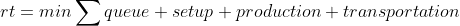
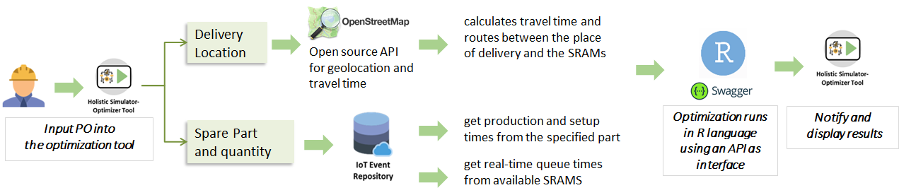

# Operational Optimizator by FASTEN

This document describes the operational optimization tool for the TSK use case in the FASTEN project. The main purpose of this application is to provide a model for production order allocation in a distributed manufacturing environment.

## Basic model description

The developed allocation model performs the optimization based on an exhaustive search algorithm considering all available options within a defined sample space. The data is consumed by the IoT application system, and by an external open source API of [**Open Route Service**](https://openrouteservice.org/) for the estimation of transport times dynamically between multiple locations.

The proposed model was implemented in R 3.5.2 language, using the libraries `dplyr` for data manipulation, `httr` for HPPT communications,`plumber` for API development and `jsonlite` for manipulation of .json files. The application was implemented using the **REST** architecture and the *framework* [**swagger**](https://swagger.io/).

The model performs a local optimization for each production order to an SRAM unit, using the __data inputs__:

  - Queue times
  - Setup times
  - Production times
  - Transportation times

The __objective function__ should minimize the total response time:



The model integration with the FASTEN platform and the main technologies related are showed in this diagram:



## Requirements, Installation and Execution

The model uses a docker environment to initialize the application is necessary install docker, build the container image and run the model:

- To install docker in a Linux environment:
```
sudo apt-get update
sudo apt install docker.io
```

- To build the container image go to the `src` directory that contain the application and the 'dockerfile' that defines the container dependencies and structure. Use the command to build the image:
```
docker build -t api-allocate .
```

- To run the application is necessary define two environment variables:(a) the API key for Open Rote Service and (b) the database OAS URL. You need to define to the port that the application will run after `-p`. Then, use the command:
```
docker run --env DATABASE_OAS_URL="PUT HERE THE DATABASE URL" --env ORS_API_KEY="PUT HERE YOUR API KEY" -d -p PORT:PORT api-allocate:latest
```

The API will start to run and you can use the swagger interface to interact, to do this includes `/__swaggwe__/` in the end of the url. If you are running the application in localhost in the port 8080 for example, the url will be: `https://localhost:8080/__swaggwe__/`.

---

Ícaro Agostino, 26/05/2020
